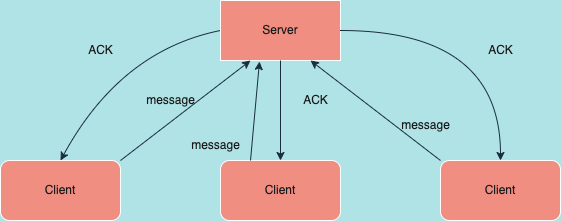

# Assignement 1 Distributed System

@author: Filippo Casari

### example of the last exercise scenario


## Exercise 1
To run the server, compile the java code and open the terminal and run the following command:
```
$ telnet 127.0.0.1 8080
```
## Exercise 2
To run the server just follow the instruction as explained above in the previous ex. 
The client must be run by passing as arguments:
```
[ip][port]
```
## Exercise 3
I implemented a program the spawn 3 threads. Each one has his own id and after a fixed delay it terminates. 
Run the file:
```
SpawningThread.java [num_threads]
```
 This value is set to 3 by default if the user does not provide any arguments.
## Exercise 4
The server handles multi clients by using multithreading style. It starts a new thread whether a new client would communicate with the running server. 

